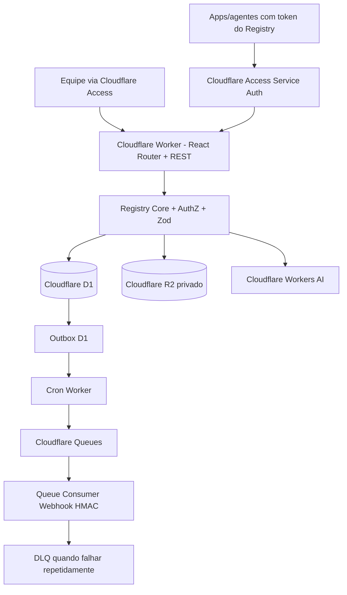

# 02 — Arquitetura Cloudflare-native (decisão D-01: APROVADA)

**Status:** proposta técnica v0.2, sem implementação. Decisão do usuário: **100% Cloudflare**. Os PDFs originais sugerem PostgreSQL/JSONB; D1/SQLite é uma substituição de implementação explícita, não um requisito textual das fontes.

## Stack e responsabilidade

- **UI:** React Router v7 em framework mode + TypeScript + Vite + Tailwind, servido por **Cloudflare Workers** e Static Assets. Escolhido para usar plugin Cloudflare Vite diretamente. Alternativa: Next.js via vinext (em beta em 2026) só com ADR específica de compatibilidade.
- **API `/v1`:** mesmo Worker, endpoints de recursos React Router ou roteador HTTP modular (Hono opcional) atrás de um único pipeline auth/authz/schema; OpenAPI em `contracts/openapi.yaml`.
- **Persistência:** **Cloudflare D1/SQLite**, migrações por Wrangler; Drizzle SQLite ou SQL parametrizado; campos complexos como JSON TEXT validado (`json_valid`), arrays por JSON ou tabelas de ligação; UUIDs gerados no app.
- **Arquivos:** **R2 privado** com objetos content-addressed por SHA-256 de anexos .md/.txt/.json; definição versionada em D1 guarda manifest imutável. Sem R2 público.
- **Eventos:** outbox transacional D1 + **Queues** para entrega e DLQ; **Cron Trigger** cada minuto varre pendências e reencaminha casos sem enfileiramento.
- **Inferência manual:** **Workers AI binding** `AI`, modelo configurado e explicitamente disponível; preview de texto sem inferência; teste de Skill apenas esquema/instruções (sem code execution).
- **Identidade:** **Cloudflare Access** antes do Worker para humanos; identidade Access verificada no middleware, com RBAC/escopo na aplicação em D1. Tokens aleatórios próprios emitidos pelo Registry para chamadas de aplicações — nunca confundir token de API do Registry com token administrador da Cloudflare. O mesmo hostname permite UI e API, com política Access de login e Service Auth para callers, se adotado; revogação e scopes são validados pelo Registry.
- **Logs e operação:** Workers Observability + D1 audit append-only, rotas health internas; ambientes `local`, `preview` e `production` com D1/R2/Queue isolados. CI no GitHub pode rodar testes, **hosting e dados permanecem 100% Cloudflare**.



## Contratos invariantes

1. Autenticar **antes** de consultar asset. `Access` autentica pessoa/aplicação na borda; RBAC do Registry em D1 determina permissões e visibilidade. Nunca confiar em workspace_id sem membership/token autorizado. Não assumir que `ctx.access` exista após Service Binding ou roteamento por Static Assets — validar a identidade efetivamente recebida e ter testes de integração em produção.
2. `ai_asset_versions`: somente INSERT. `definition_hash` depende de canonical JSON; versão antiga imutável, hash deduplicado, `notes` imutáveis. Uma mudança de metadata NÃO cria nova versão.
3. **Concorrência de versões:** D1 `batch()` transacional, precondition guard explícita (ex.: `version_write_guards` e trigger RAISE), UPDATE de `latest_version` e INSERT da versão; 409 se base obsoleta, nunca criar buracos ou audit órfão.
4. **Concorrência de aliases:** um UPSERT condicional `expected_revision`/CAS em D1; trigger AFTER INSERT/UPDATE do alias grava auditoria e evento outbox NA MESMA TRANSAÇÃO. Retorno de zero linhas = 409. Gates de review/test devem ser verificados em consulta consistente e também pelo write de publicação ou guarda transacional, não somente por pré-checagem fora da transação.
5. **Leitura production:** resolver alias consultando D1 primário em cada requisição; NÃO cachear aliases em KV/Cache API no MVP. Não usar leitura eventual para publication; `withSession('first-primary')` se usar Sessions API para leituras sensíveis.
6. **Outbox:** a escrita de estado/audit/evento termina em D1 antes do enqueue. Se Queue indisponível, Cron recupera; Queues podem reentregar, consumidor deduplica por `event_id+endpoint_id` e usa assinatura HMAC, status, retries e backoff. Não prometer entrega exactly once pela rede.
7. **Anexos:** upload autenticado e validado; R2 recebe primeiro objeto SHA + verifica integridade; só depois D1 snapshot referencia objeto. Objeto temporário não referenciado será coletado por GC seguro. Nunca executar anexos.
8. **Dados de IA:** prompt rendering validado, sem `eval`; não guardar input/output bruto por padrão; traces com hashes, versão exata e metadata. Um resolve não é equivalente a executar um LLM.

## Estrutura alvo

```
app/                   # rotas React Router, layout, páginas e boundary de erros
workers/app.ts         # fetch + queue + scheduled entry (ou split em workers/*)
src/registry/          # assets, versions, aliases, resolve, audit, tests, webhook
src/platform/          # Access identity, D1 adapter, R2 adapter, AI, queues
src/contracts/         # Zod schemas e tipos derivados
migrations/            # D1 SQL migrations, sem PostgreSQL
contracts/openapi.yaml
wrangler.jsonc         # gerado no bootstrap, bindings por ambiente
wrangler.example.jsonc # desenho inicial sem IDs reais
```

## Trade-offs Cloudflare

- D1 usa SQL compatível com SQLite, **não** PostgreSQL: `JSONB`, `UUID` nativo, `text[]`, `timestamptz`, `FOR UPDATE SKIP LOCKED`, `pgcrypto`, `plpgsql`, GIN e RLS do Postgres NÃO estão disponíveis.
- R2 é armazenamento de objetos separado, portanto não participa da transação D1. Precisa processo de reconciliação.
- Access protege o perímetro, mas **não** substitui RBAC e autenticação de tokens do app; API pública para apps requer desenho de rota/Service Auth seguro.
- Workers AI depende do catálogo/modelos e de quotas; validar modelo escolhido no primeiro deploy; nada aqui implica Workers AI executar Skills arbitrárias.
- Adicionar Durable Objects, KV ou Workflows somente quando um caso real exigir. Nenhum é requisito inicial.

**Fontes Cloudflare oficiais:**
- https://developers.cloudflare.com/workers/framework-guides/web-apps/react-router/
- https://developers.cloudflare.com/workers/configuration/cloudflare-access/
- https://developers.cloudflare.com/d1/worker-api/d1-database/
- https://developers.cloudflare.com/d1/best-practices/read-replication/
- https://developers.cloudflare.com/queues/get-started/
- https://developers.cloudflare.com/workers-ai/configuration/bindings/
- https://developers.cloudflare.com/workers/tutorials/upload-assets-with-r2/