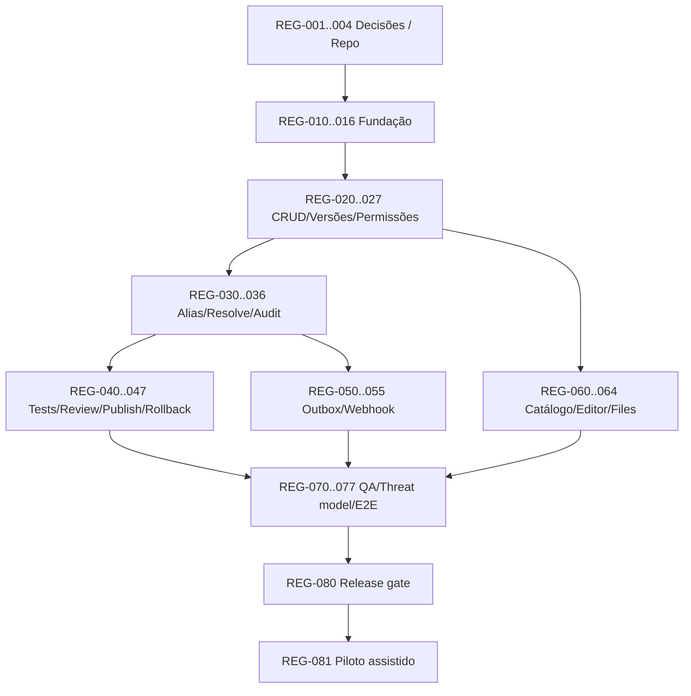

# 10 — Plano completo, dependências, tarefas e cenários

**Planejamento:** entregáveis ordenados pelo grafo de dependências. Estimativas abaixo são **ordens de grandeza** para 1 desenvolvedor familiarizado com stack, não promessas de cronograma. O piloto só inicia após decisões D-01–D-05; não criar cronograma fixo sem disponibilidade da equipe.

## Resultado-alvo / marcos

| Marco | Critério verificável | Dependências |
|---|---|---|
| M0 — Governança | Decisões e contratos aprovados, repo privado preparado | — |
| M1 — Foundation | Login, workspace, DB, migrações, CI e health | M0 |
| M2 — Registry core | Prompt/Skill CRUD, versions, ACL, catálogo | M1 |
| M3 — Delivery runtime | aliases, resolve determinístico, trace, audit | M2 |
| M4 — Governance | diff, review opcional, tests, publish/rollback | M3 |
| M5 — Integrations | UI completa, files, playground, webhooks/outbox | M4 (partes paralelas) |
| M6 — Release | Segurança, E2E mobile, load/backup, operação piloto | M5 |

## Grafo de execução

## Backlog atômico — cada linha rende issue/PR sem misturar responsabilidade

Status inicial de todos: `READY` após os gates indicados; enquanto decisão D-01–D-05 estiver aberta, tarefas dependentes são `WAITING_DECISION`. Prioridades: P0 bloqueia MVP; P1 importante para fluxo completo; P2 conveniência.

| ID | Pri | Tarefa | Pré-condição | DoD objetivo | Est. |
|---|---|---|---|---|---|
| REG-001 | P0 | Aprovar ADR stack/hospedagem/auth | fontes lidas | ADR D-01/D-02 fechado | 0.5d |
| REG-002 | P0 | Aprovar política review, LLM, payload | REG-001 | D-03/D-04/D-05 fechado | 0.5d |
| REG-003 | P0 | Criar repo privado, labels, templates, protection | REG-001 | main protegida, CI exigida, owners | 0.5d |
| REG-004 | P0 | Congelar PRD/API v0.1 e matrizes | REG-002 | specs base reviewadas | 0.5d |
| REG-010 | P0 | Bootstrap TS/Next/tests/lint/typecheck | REG-003 | `npm run check` verde | 1d |
| REG-011 | P0 | DB local/migration runner | REG-010 | DB nova sobe e migra | 1d |
| REG-012 | P0 | Organizations/workspaces/membership | REG-011 | tenancy por IDs + fixtures | 1d |
| REG-013 | P0 | Auth invite/login/logout/sessão | REG-012 | E2E 2 usuários e erro 401 | 1–2d |
| REG-014 | P0 | Middleware Authz/context | REG-013 | teste cross-workspace e private | 1–2d |
| REG-015 | P0 | Erros REST, request_id, pagination, validation | REG-010 | schemas + contrato + tests | 1d |
| REG-016 | P0 | CI PR + env template + seeds sem secrets | REG-010 | pipeline pass e docs | 0.5d |
| REG-020 | P0 | Migração ai_assets/versions | REG-011,014 | constraints + no-update | 1d |
| REG-021 | P0 | Criar/listar/ler/metadata Prompt | REG-020,015 | CRUD + authz tests | 1–2d |
| REG-022 | P0 | Definição Prompt, validação placeholders/schema | REG-021 | edge cases unit | 1d |
| REG-023 | P0 | Skill definição e validação textual | REG-020,015 | CRUD Skill + tests | 1–2d |
| REG-024 | P0 | Canonical JSON/hash/dedup/version lock | REG-022,023 | prova imutabilidade e concurrency | 1–2d |
| REG-025 | P1 | Archive/delete/restore autorizado | REG-021,023 | histórico preservado, resolve bloqueado | 1d |
| REG-026 | P1 | Catálogo filtros/paginação/owner/aliases | REG-021,023 | combinação de filtros confiável | 1d |
| REG-027 | P0 | Tokens de serviço e scopes + revogação | REG-014,015 | token vazamento/revogação testados | 1–2d |
| REG-030 | P0 | Audit append-only com segurança | REG-020,014 | alterações críticas sem gaps | 1–2d |
| REG-031 | P0 | Alias table + CAS/locks | REG-024,030 | corrida sem lost update | 1–2d |
| REG-032 | P0 | Resolve Prompt por id/nome/version/alias | REG-031,027 | conteúdo e versão exata | 1–2d |
| REG-033 | P0 | Resolve Skill (sem executar tools) | REG-032 | pacote textual + hashes | 1d |
| REG-034 | P0 | Traces de resolução, executions report | REG-032,030 | sem payload bruto, trace coerente | 1–2d |
| REG-035 | P0 | Diff texto/JSON/arrays/assets | REG-024 | diffs v1/vN testados | 1–2d |
| REG-036 | P1 | Rate limits e input size caps API | REG-027 | abuso básico bloqueado | 1d |
| REG-040 | P0 | Test case entities e test runs | REG-024,030 | histórico por version/case revision | 1–2d |
| REG-041 | P0 | Validadores exato/contains/schema | REG-040 | passes/fails reproduzíveis | 1d |
| REG-042 | P0 | Preview variáveis Prompt + errors | REG-032 | interpolation safe sem code eval | 1d |
| REG-043 | P1 | Playground adapter LLM Prompt | REG-042,040 | real adapter + mocked CI + custos | 1–2d |
| REG-044 | P1 | Review básico (opcional por policy) | REG-024,030 | regras de autor/reviewer | 1–2d |
| REG-045 | P0 | Publish staging/production policy | REG-031,040,044 | blocker de test/review/role | 1–2d |
| REG-046 | P0 | Rollback production com reason | REG-045 | alias volta, audit persiste | 1d |
| REG-047 | P1 | UI review/test/publish feedback | REG-043,045 | explica bloqueios e outcomes | 1d |
| REG-050 | P0 | Outbox na transação de publish | REG-030,045 | nenhuma publicação sem evento | 1–2d |
| REG-051 | P0 | Configurar webhooks com SSRF guard | REG-050 | URL validation e segredo | 1–2d |
| REG-052 | P0 | Worker lease/backoff/HMAC | REG-051 | retries, event_id, sem duplicar record | 1–2d |
| REG-053 | P1 | Tela delivery status e retry admin | REG-052 | tentativas consultáveis | 1d |
| REG-054 | P1 | Métricas/alertas backlog worker | REG-052 | alerta backlog crescente | 0.5d |
| REG-055 | P1 | Teste webhook cliente exemplo | REG-052 | receptor HMAC e idempotência | 0.5d |
| REG-060 | P1 | Shell UI/mobile/login | REG-013 | mobile smoke+acessibilidade | 1–2d |
| REG-061 | P1 | Catálogo filtros e detalhe | REG-026,060 | UX mobile + states | 1–2d |
| REG-062 | P1 | Form Prompt/Skill/editor/versões | REG-024,060 | não sobrescreve versão | 2–3d |
| REG-063 | P1 | Diff/test/playground screens | REG-035,043,060 | trace de teste no UI | 2d |
| REG-064 | P1 | UI aliases/rollback/audit/execution | REG-034,046,060 | sem horizontal overflow | 1–2d |
| REG-065 | P1 | Attachments upload/preview/edit Skill | REG-023,062 | 1 MB/10, SHA, sem executable | 1–2d |
| REG-070 | P0 | Teste multitenant/RBAC/bypass | REG-014,064 | suite negativa sem falhas | 1–2d |
| REG-071 | P0 | Teste concurrency version/alias/outbox | REG-050 | sem write race nem orphan | 1–2d |
| REG-072 | P0 | 15 E2E doc-acceptance | REG-065,053 | 15 cenários verdes | 2d |
| REG-073 | P0 | Scanner secrets/uploads/SSRF/rate limits | REG-065,051 | casos abusivos e controles | 1–2d |
| REG-074 | P0 | Backup/restore e runbook | REG-050 | restauração ensaiada | 1d |
| REG-075 | P1 | Mobile real / accessibility | REG-064,065 | 375px e mobile smoke | 1d |
| REG-076 | P1 | Performance smoke + baseline telemetry | REG-034,054 | p50/p95 e limites documentados | 1d |
| REG-077 | P0 | Production configuration/secrets/env | REG-074,075 | auth, runner, webhooks isolados | 1d |
| REG-080 | P0 | G-RELEASE review final | REG-070..077 | checklist fechado e aprovação | 0.5d |
| REG-081 | P1 | Piloto com 1 Prompt+1 Skill reais | REG-080 | app consumidor resolve, rollback real | 1–2d |

**Tamanho estimado bruto:** aproximadamente 55–85 dias-pessoa combinando engenharia, QA, ajustes e operação (faixa não validada); entrega útil já emerge em M2/M3. Paralelizar UI/worker/testes após interfaces estabilizadas. Não converter diretamente em prazo de calendário sem considerar pessoa/equipe e escolhas.

## Caminho crítico e execução inicial

`D-01..05 → REG-003 → REG-010/011/012/013/014 → REG-020/021/022/024 → REG-030/031/032 → REG-040/045/046/050/052 → REG-072/070/071/074 → REG-080 → REG-081`. UI começa em paralelo em REG-060 após auth; sua finalização é outra pré-condição de release.

**Fronteira executável após decisões:** REG-003, REG-004. **Após repo:** REG-010 e documentação da CI. Não iniciar UI de publicação antes dos contratos de policy e alias, para evitar acoplamento incorreto.

## Gates (não dispensáveis)

- **G0 Decisões:** D-01..05 aprovadas; critérios de aceite e escopo confirmados.
- **G1 Fundação:** auth, memberships, DB, CI com testes de isolamento.
- **G2 Integridade:** imutabilidade, dedup, transações, alias CAS e auditoria verificados.
- **G3 Governança:** roles, review opcional, tests gates, rollback, outbox.
- **G4 Segurança/QA:** E2E, multi-tenant, mobile, secret scanner, SSRF, backup/restore e load baseline.
- **G-RELEASE:** G0..G4 concluídos, runbook, owner operacional e aprovação humana do deploy.

## Planos alternativos/contingências

| Evento/trigger | Plano A | Plano B | Fallback |
|---|---|---|---|
| Auth provider atrasa | usar gerenciado configurado | avaliar alternativa por ADR | pausar features mutáveis; não login hardcoded |
| Runner serverless não entrega | job externo protegido com lease | pequeno worker container | suspender publication external até confiabilidade verificada |
| Sem credencial LLM | usar preview e mock apenas em CI | integrar provedor depois | não declarar playground LLM real pronto; manter G3 pendente se requisito confirmado |
| Testes obrigatórios falhando | corrigir versão/tests | publicar versão anterior por rollback | emergência admin com audit e motivo, se ADR aprovada |
| API fica lenta | medir índices/pool | cache apenas versões imutáveis | não cachear production alias sem invalidação |
| Falha de migração | interromper rollout e inspecionar | forward fix compatível | restore com reconciliação cuidadosa |
| Equipe menor que estimada | manter MVP must | adiar polish/review UI avançado | preservar todos os 15 critérios documentais |

## Gestão de dependências e mudança

Cada issue deve ter ID `REG-###`, objetivo, precondições, dependências, estados, cenário fallback, risco, DoD e evidência PR/test. Não criar tarefas duplicadas se a issue já existir. Antes de sincronizar qualquer task manager: READ → NORMALIZE → MATCH → DIFF → VALIDATE; preservar histórico já concluído. Este pacote **não** cria nem altera Todoist/GitHub por si só.