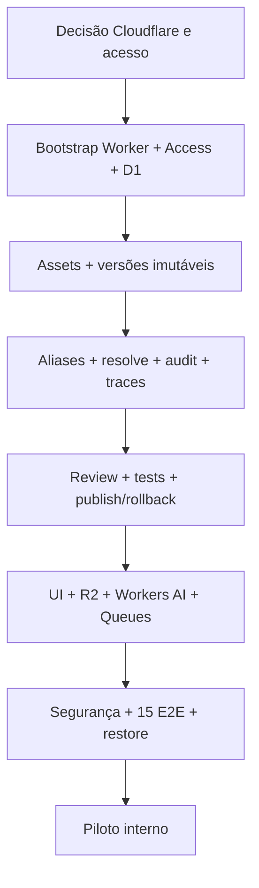

# Plano executivo — Prompt & Skill Registry 100% Cloudflare

**Status:** especificação revisada v0.2; nenhum deploy, repositório novo ou backend implementado.

## Decisão fechada

**Infraestrutura executável e dados inteiramente na Cloudflare:** Worker/React Router 7 para Studio + API; D1 para catálogo, snapshots, aliases, RBAC e auditoria; R2 para anexos; Workers AI para playground; Queues/Cron para webhooks; Access para login interno. Testes/CI podem executar no GitHub, mas os recursos produtivos são Cloudflare. Postgres/Supabase/Vercel **saíram da implementação**.

## Produto

Catálogo Prompts/Skills, `private`/`workspace`, edit metadata, novas versões imutáveis, diff, staging/production, rollback com motivo, gate review+testes, OpenAPI resolve por versão/alias, traces, playground manual, anexos texto Skill (10 arquivos de até 1MB), webhooks HMAC com retry.

## Milestones

- **M0 — Foundation decisions:** Registrar ADR D-01 aprovado; validar hostname Cloudflare, emails Access, modelo AI, quotas e política de review.
- **M1 — Base Cloudflare:** repo, scaffold Cloudflare React Router, Workers D1 local/preview, migrations, authz, CI.
- **M2 — Catálogo:** Prompt/Skill CRUD, metadata e v1/vN imutáveis, anexos R2.
- **M3 — Runtime:** aliases CAS, resolve coerente no primário D1, audit/outbox/trace.
- **M4 — Governança:** testes, revisão opcional, publicação/rollback seguro, diff.
- **M5 — Integração:** telas completas desktop/mobile, Workers AI, Queues + Cron e HMAC.
- **M6 — Aceite:** testes de cross-tenant/concorrência, restore D1 isolado, R2, Access, webhooks, 15 critérios PRD, piloto com consumo real.

**Gates:** G0 decisões; G1 auth+DB; G2 versão/alias/consistência; G3 review/webhooks/AI; G4 QA/backup/segurança; G-RELEASE exige todos.

## Caminhos alternativos (sem mudar a decisão 100% Cloudflare)

| Evento | Plano A | Contingência |
|---|---|---|
| Access não autentica no roteamento SSR | usar `ctx.access` quando verificado / validar JWT assinado | isolar Worker API e UI em hosts distintos, ainda protegidos por Access |
| D1 contention ou performance | CAS, índices e consultas primárias | otimizar consultas e reduzir retenção de traces; avaliar DO apenas com evidência |
| Queue indisponível | outbox transacional + Cron | reprocessar DLQ com event_id e lease |
| Workers AI sem modelo/quota | escolher outro modelo suportado | manter preview, não fingir LLM tests concluídos |
| R2 grava mas D1 falha | content-addressed blob + GC de órfãos | reconciliar manifesto e objetos, nunca eliminar blob referenciado |
| Exigência de Next.js | verificar vinext beta em protótipo | React Router nativo Cloudflare permanece opção padrão |

## Fronteira executável

`REG-001` (ADR infraestrutura, concluída por escolha do usuário) → `REG-003` repositório → `REG-010` bootstrap React Router/Workers → `REG-011` D1 migrations → `REG-013/014` Access/authz → `REG-020+` domínio. Novos itens Cloudflare `REG-082..098` no [roadmap](docs/10-roadmap.md).

**Restrições:** não criar/alterar Cloudflare, GitHub ou Todoist sem nova solicitação explícita; nenhuma migração remota foi feita. Ver [runbook](docs/14-cloudflare-deployment.md) e [fonte vs decisões](docs/16-cloudflare-source-deltas.md).