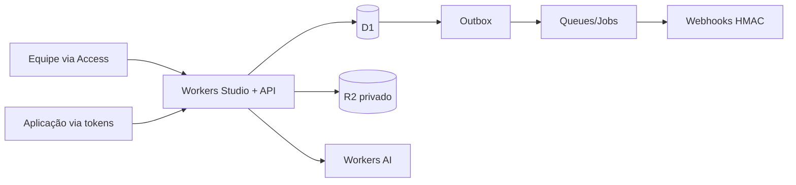

# Prompt & Skill Registry — MVP 100% Cloudflare

**Versão do blueprint:** 0.2 (2026-10-09). **Status:** arquitetura e especificações; **não há aplicativo implementado, recursos Cloudflare provisionados ou deploy**.

A decisão do usuário substitui o banco PostgreSQL e hospedagem Next/Vercel do plano anterior por **infraestrutura executada 100% na Cloudflare**. O produto permanece o dos 3 PDFs: Prompt/Skill versionados, aliases, resolução, testes manuais, publicação/rollback, auditoria, webhooks e rastreio. O PRD original tem **15 critérios de aceite** que continuam obrigatórios.

## Stack aprovada / proposta

| Componente | Solução | Status |
|---|---|---|
| Compute, UI e API | **Cloudflare Workers** + React Router 7 / Vite / TypeScript | Proposta técnica dentro da decisão Cloudflare |
| DB e migrations | **Cloudflare D1** (SQLite) | Decisão aprovada |
| Arquivos Skill | **Cloudflare R2** privado content-addressed | Proposta técnica |
| IA do playground | **Cloudflare Workers AI** | Decisão aprovada; modelo/quotas pendentes |
| Entrega webhook | **Cloudflare Queues + DLQ + Cron** | Proposta técnica |
| Login interno | **Cloudflare Access** + autorização própria em D1 | Proposta técnica |
| Traces/observability | Workers logs + tabelas D1 | Proposta técnica |

**Fora do MVP:** execução arbitrária de código, hospedagem de agentes, MCP server completo, marketplace, semver, A/B/canary automático, autoavaliação LLM-as-judge.

## Fluxo principal

## Documentos (ordem recomendada)

1. [Plano executivo](PLANO-GERAL.md), [PRD](docs/01-prd-mvp.md), [rastreabilidade](docs/00-source-traceability.md).
2. [Arquitetura Cloudflare](docs/02-architecture.md), [dados D1](docs/03-data-model.md), [transações D1](docs/15-d1-transactions.md).
3. [API](docs/04-api-spec.md), [OpenAPI](contracts/openapi.yaml), [auth e políticas](docs/05-auth-and-policy.md), [ciclo de vida](docs/06-lifecycle.md).
4. [Playground](docs/07-testing-playground.md), [interface](docs/08-ui-spec.md), [segurança/operação](docs/09-security-ops.md).
5. [Roadmap](docs/10-roadmap.md), [QA](docs/11-qa-acceptance.md), [ADRs e riscos](docs/12-decisions-risks.md), [handoff](docs/13-handoff.md).
6. [Deploy Cloudflare](docs/14-cloudflare-deployment.md), [mudanças em relação aos PDFs](docs/16-cloudflare-source-deltas.md).

**Artefatos:** `db/schema.sql` e `migrations/0001_init.sql` são modelo SQL SQLite/D1 **referencial**; `wrangler.example.jsonc` contém placeholders **não deployáveis**; `examples/` são fixtures de definição. Os PDFs originais permanecem em `sources/` para rastreabilidade. `tests/sqlite_schema_smoke.py` testa o DDL SQLite local; nenhum teste valida Workers/D1 remoto ou runtime real.

## Próximos passos

1. Decisões já tomadas: stack 100% Cloudflare/D1; falta validar hostname da aplicação, pessoas permitidas no Access, Workers AI modelo e orçamento, política review.
2. Criar o repositório privado (sugestão `prompt-skill-registry`) e copiar este pacote. **Não criar nem publicar sem solicitação explícita**.
3. Scaffold React Router v7 pela CLI Cloudflare, gerar `wrangler.jsonc` real com IDs de recursos separados para `preview` e `production`, integrar D1 SQL e contratos.
4. Implementar tarefas `REG-###` por dependência (não assinalar Done apenas porque há documentação); passar gates G0–G4 e os **15 cenários do PRD** antes do piloto.

**Referências Cloudflare:** [React Router](https://developers.cloudflare.com/workers/framework-guides/web-apps/react-router/), [D1](https://developers.cloudflare.com/d1/), [Access](https://developers.cloudflare.com/workers/configuration/cloudflare-access/), [R2](https://developers.cloudflare.com/r2/), [Queues](https://developers.cloudflare.com/queues/), [Workers AI](https://developers.cloudflare.com/workers-ai/).