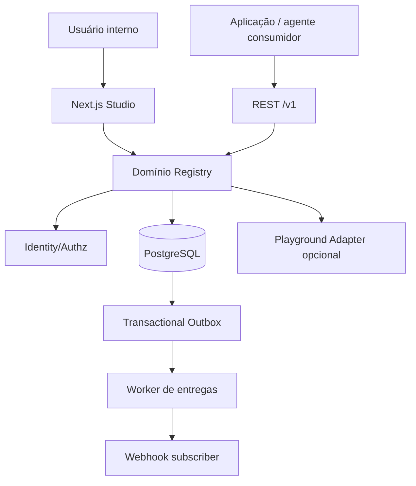

# 02 — Arquitetura do MVP

## Decisão arquitetural recomendada (não imposta pelas fontes)

**Monólito modular no mesmo repositório** para UI + REST + regras de domínio, com um worker leve para eventos; não introduzir microserviços nem fila/cache distribuídos antes de necessidade real. É a tradução simplificada dos Asset/Version/Alias/Review/Test/Resolve/Audit/Trace Services propostos no RFC.

**Stack proposta (validar ADR-001):** Next.js (App Router) + TypeScript; React; Postgres gerenciado (ex.: Supabase Postgres); Drizzle ORM + migrações SQL; Zod para payloads/contratos; Auth gerenciado (ex.: Supabase Auth) com login por convite; Tailwind + biblioteca de componentes acessíveis; Vitest para testes; Playwright E2E; lint + typecheck; Sentry/OpenTelemetry opcionais. Não fixar números de versão sem verificar compatibilidade durante bootstrap. Um provider LLM server-side no playground é **plugável**.



## Estrutura sugerida do futuro repositório

```text
app/                 # UI autenticada, rotas /v1 REST e páginas de erro
src/modules/
  assets/            # metadata, catálogo, archive/delete
  versions/          # normalize/hash/dedup/diff
  aliases/           # publish, rollback, CAS
  permissions/       # authz, workspace, private access
  runtime/           # resolver + variable rendering + traces
  playground/        # test cases + provider adapter
  reviews/           # política básica de aprovação
  audit/             # eventos append-only
  webhooks/          # outbox + HMAC + retry
src/db/              # schema/migrations/repositories
src/shared/          # zod, errors, request context, logging
worker/              # runner com lease de outbox; endpoint privado ou processo dedicado
tests/{unit,integration,e2e,fixtures}/
docs/ contracts/ db/ examples/ .github/
```

## Limites internos e regras de dependência

- UI e HTTP são adaptadores; **não** contêm autorização de negócio isoladamente.
- Serviços do domínio recebem `ActorContext` validado `{userId|serviceTokenId,orgId,workspaceId,scopes,roles,requestId}`.
- Repositórios DB aceitam workspace, nunca buscam por asset_id sem autorização prévia e filtro de tenant.
- Every write: transaction + domain changes + audit; se evento precisa de webhook: outbox na **mesma transação**.
- Tokens de serviço só acessam endpoints explicitamente autorizados; não usam sessão do navegador.
- `resolve` é consulta determinística (não chamará modelo). `playground` pode chamar modelo apenas por ação explícita.

## Fluxo de resolução

1. Validar token/sessão e membership do workspace solicitado.
2. Identificar asset por UUID ou `(workspaceId,type,name)`; verificar private/workspace e `asset.run|asset.read`.
3. Validar version OR alias (exatamente um), resolver alias no banco na mesma leitura lógica.
4. Obter snapshot imutável, validar asset `active`, renderizar variáveis do Prompt com escaping literal, nunca interpretar JS/Handlebars helpers.
5. Registrar resolution trace `{asset,alias?,resolved_version,definition_hash,actor,request_id,latency,status}` sem payload bruto.
6. Retornar versão exata, hash e `trace_id`; erro padronizado para ref inválida ou permissão insuficiente.

## Fluxo de publicação/rollback

- Transaction atomic: lock asset/alias → conferir expected_version/current_alias revision → validar policies/tests/review → UPDATE ou INSERT alias → audit event → outbox event → commit.
- Sem cache de aliases no MVP; toda nova resolve após commit enxerga o novo ponteiro (considerando leitura primária).
- Se webhook estiver indisponível, publish **permanece válido** e outbox tenta novamente; UI deixa visível a entrega pendente.

## Autenticação, ambientes e deploy

- `local`: Node + Postgres via Compose, stub/test LLM. `preview`: build por PR contra banco isolado, sem credenciais de produção. `production`: UI privada + REST autenticada + Postgres persistente + outbox runner.
- Dois ambientes de dados independentes: staging interno para QA e production. Não confundir com aliases `staging` e `production`, que são **ponteiros de conteúdo** dentro do registro.
- Migrações CI verificadas; execução prod é etapa controlada com backup e observabilidade.
- Operação sem Redis e sem blob storage até que métricas justifiquem; modo de runner precisa ser confirmado no deploy escolhido.

## Escolhas não resolvidas

Vercel/serverless + runner agendado versus servidor com worker contínuo; provedor Auth; provedor LLM; SLO/custos internos. Ver `12-decisions-risks.md`.